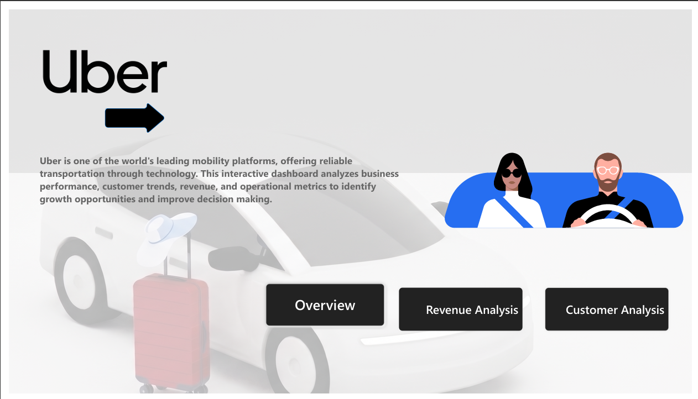
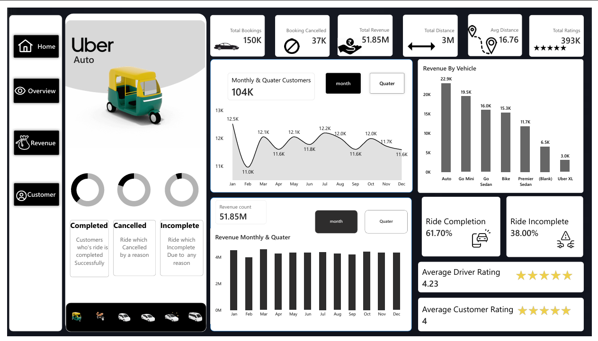

🚖 Project Overview

Urban ride-hailing platforms generate massive volumes of operational data every day, but raw booking records alone don't answer critical business questions. Operations managers, revenue analysts, and business stakeholders need clear insights into booking performance, revenue trends, customer behavior, and operational bottlenecks before making strategic decisions.

This project transforms Uber ride-booking data into an interactive Power BI Business Intelligence Dashboard designed to support data-driven decision-making. Using Power BI, Power Query, and DAX, the dashboard converts raw transactional data into meaningful visual insights across multiple business dimensions.

The solution follows a complete BI workflow—from data preparation and modeling to KPI development, interactive visualization, and business recommendations—simulating how analytics dashboards are built for real-world organizations.

🎯 Business Problems Addressed

This dashboard helps answer key operational and business questions, including:

How many bookings are completed, cancelled, or left incomplete?
Which vehicle types generate the highest revenue and bookings?
Which pickup locations experience the highest customer demand?
During which time slots is ride demand at its peak?
How much revenue is lost because of ride cancellations and incomplete trips?
Which payment methods contribute the highest revenue?
How do customer booking trends change over daily, weekly, monthly, and quarterly periods?
Which operational improvements can help maximize revenue and ride completion?
📊 Dashboard Summary

The dashboard is organized into multiple interactive pages, each focusing on a specific business domain.

🏠 Home
<h2>🏠 Home Page</h2>

The landing page introduces the project with Uber branding, dashboard navigation, and a brief overview of the business objectives.

📈 Executive Overview
<h2>📊 Executive Overview</h2>

Provides a high-level summary of business performance through interactive KPIs and visualizations, including:

Total Bookings
Completed Bookings
Cancelled Bookings
Incomplete Bookings
Total Revenue
Total Distance
Average Ride Distance
Ride Completion Rate
Revenue by Vehicle Type
Monthly & Quarterly Booking Trends
Driver Rating
Customer Rating
💰 Revenue Analytics

Focuses on revenue performance and revenue optimization.

Features include:

Total Revenue
Revenue Opportunity
Revenue Recovery Rate
Average Revenue per Booking
Average Monthly Revenue
Revenue Leakage Waterfall Analysis
Revenue by Vehicle Type
Revenue by Payment Method
Revenue by Time Slot
Highest Revenue Pickup Location
Business Recommendations
👥 Customer Analytics

Provides insights into customer demand and booking behavior.

Includes:

Daily Customers
Weekly Customers
Monthly Customers
Current vs Previous Month Customers
Customer Distribution by Vehicle Type
Peak Demand Time Slots
Top Pickup Locations
Customer Cancellation Analysis
Customer Trend Comparison
Business Insights & Recommendations
📈 Key Business Insights

The dashboard uncovers several actionable business insights:

🌆 Evening is the highest revenue-generating time slot.
📍 Airport is the busiest pickup location with the highest customer demand.
🚗 Vehicle performance varies significantly across categories, highlighting opportunities for better fleet allocation.
💰 Revenue leakage is primarily driven by cancellations and incomplete bookings.
💳 Digital payment methods contribute the largest share of total revenue.
📊 Monthly and quarterly analysis enables trend monitoring and performance comparison.
🎯 Optimizing driver allocation during peak hours can improve ride completion rates and increase overall revenue.
🛠 Technical Implementation

This project demonstrates the complete Business Intelligence development lifecycle using Microsoft Power BI.

Technologies Used
Microsoft Power BI Desktop
Power Query
DAX (Data Analysis Expressions)
Excel
Data Modeling
Key Features
Interactive Navigation
Dynamic KPI Cards
Vehicle-wise Analysis
Month & Quarter Toggle
Revenue Waterfall Analysis
Customer Analytics
Business Recommendation Panel
Cross-filtering
Responsive Dashboard Layout
Uber-inspired UI Design
📌 Core KPIs

The dashboard tracks business performance using interactive KPIs such as:

Total Bookings
Completed Bookings
Cancelled Bookings
Incomplete Bookings
Total Revenue
Revenue Opportunity
Revenue Recovery Rate
Revenue per Booking
Revenue per Kilometer
Average Monthly Revenue
Daily Customers
Weekly Customers
Monthly Customers
Customer Rating
Driver Rating
Ride Completion Rate
💼 Business Value

This dashboard enables stakeholders to:

Monitor business performance in real time.
Identify revenue leakage.
Understand customer demand patterns.
Optimize fleet allocation.
Improve ride completion rates.
Support strategic business decisions through interactive analytics.
🚀 Project Highlights
📊 Multi-page interactive Power BI dashboard
📈 Executive-level KPI reporting
💰 Revenue optimization analysis
👥 Customer behavior analytics
🚗 Vehicle performance insights
📍 Location-based demand analysis
⚡ Advanced DAX calculations
🎨 Modern Uber-inspired dashboard design
💡 Actionable business recommendations
